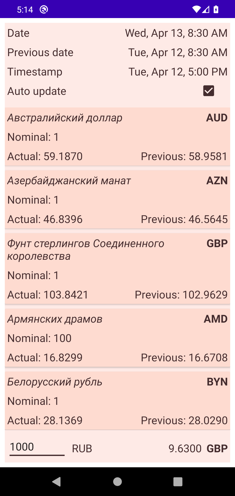

# FocusStart project

Проект был создан согласно [заданию](https://drive.google.com/file/d/122MrDCIUBKL6DkZHnSjbYOYP_6_Oy84K/view)

В проекте задействованы библиотеки:
- Retrofit 2
- Dagger Hilt

Согласно заданию:
1. Приложение загружает данные с указанного сайта
2. Загруженные данные хранятся во ViewModel. При повороте экрана и сворачивании приложения данные
   не перезагружаются
3. Данные можно перезагружать вручную посредством проведения списка сверху вниз, а также в
   автоматическом режиме, установив соответствующий флажок. Обновление происходит 1 раз в минуту.
   Состояние флажка сохраняется в preferences.
4. Предоставлена возможность конвертирования указанной суммы в рублях в выбранную валюту согласно
   формуле (рубль * номинал) / курс
